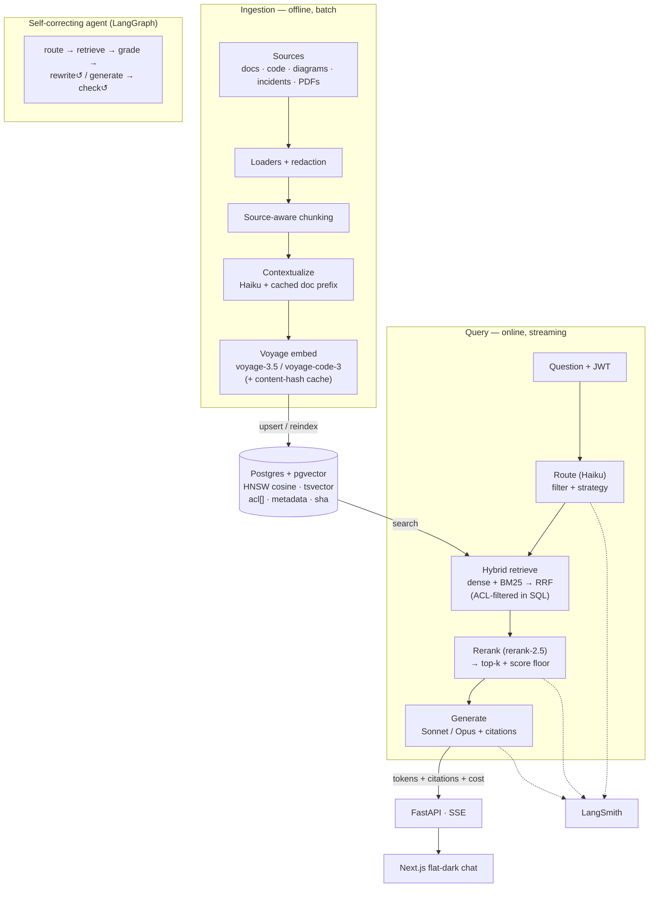

# Architecture

## Two data paths, one seam

Every RAG system is two pipelines that meet at the vector store:

1. **Ingestion (offline, batch, write-heavy)** — sources → loaders → source-aware
   chunking → contextualization → Voyage embeddings → pgvector. Latency-tolerant,
   so prompt caching and the Batches API live here.
2. **Query (online, streaming, read-heavy)** — question → route → hybrid retrieve
   → rerank → assemble → Claude with citations → SSE. Every millisecond is
   user-facing.

The two share a schema and an embedding model and nothing else: you can rebuild
either without touching the other.

## Request lifecycle

1. **Ingress** (`backend/api/query.py`) — auth (`current_principal`), rate limit,
   spend cap, then hand off to the service.
2. **Resolve** (`service._resolve`) — for a follow-up, condense history + question
   into a standalone query (history-aware retrieval).
3. **Route** (`rag/routing.py`) — a Haiku call picks a metadata filter (intent →
   doc_type, 90-day recency) and a retrieval strategy.
4. **Hybrid retrieve** (`rag/hybrid.py`) — dense (pgvector HNSW cosine) + BM25
   (`tsvector`) fused with RRF, ACL-filtered in SQL, over-fetching ~50.
5. **Rerank** (`rag/rerank.py`) — Voyage `rerank-2.5` cross-encoder → top-k; a
   score floor drops weak chunks, and an empty result short-circuits to an honest
   no-answer (no Claude call).
6. **Assemble + generate** (`llm/answer.py`) — cached system prefix + citation
   document blocks + the question; tier chosen by difficulty; adaptive thinking on
   Opus; streamed.
7. **Stream + record** — tokens + citations + usage over SSE; cost persisted to
   `request_costs`.
8. **Observe** — every stage traces to LangSmith; structured logs correlate by
   `request_id`.

## Key decisions (and the tradeoffs)

- **pgvector over a managed vector DB** — vectors co-located with metadata and
  provenance: one transactional upsert, filters as SQL. Ceiling: low-millions of
  vectors; past that, reach for a dedicated store. That's the migration trigger.
- **Two indexes (`prose_chunks` / `code_chunks`)** — `voyage-3.5` and
  `voyage-code-3` are different vector spaces; the router picks the table, the
  reranker merges cross-domain results.
- **Retrieve-many-rerank-few** — bi-encoder recall is fuzzy; the cross-encoder
  reads (query, chunk) jointly. Biggest quality jump for the least code.
- **Tiered models** — Haiku routes, Sonnet is the workhorse, Opus only for hard
  multi-hop reasoning. The router runs on the cheapest model.
- **CAG vs RAG boundary** — a small stable core lives in the cached prompt prefix
  (cache-augmented generation); the unbounded long tail is retrieved (RAG). The
  line is "does it fit and is it stable."
- **LangChain + LangGraph** — LCEL for the composable query path; LangGraph for
  the stateful, self-correcting CRAG loop. Claude-native knobs (adaptive thinking,
  cache breakpoints, citations) are passed through, not hidden.

## Security model

Auth on every route; row-level ACL (`acl && groups`) injected into every
retrieval query from the server-side principal; secrets redacted at ingestion;
retrieved content treated as untrusted data; rate limits + per-user spend caps.
See [`SECURITY.md`](SECURITY.md).

## Canonical data model

`prose_chunks` and `code_chunks` share one shape: `content`, `embedding
vector(1024)`, `doc_type`, `source_uri`, `chunk_index`, `repo`, `language`,
`title`, `content_sha256`, `acl text[]`, `metadata jsonb`, generated
`content_tsv`, `created_at`, unique `(source_uri, chunk_index)`. Ops tables:
`request_costs`, `feedback`, `embed_cache`, `ingest_jobs`. Managed via init-SQL
(docker) and Alembic (`migrations/`).
